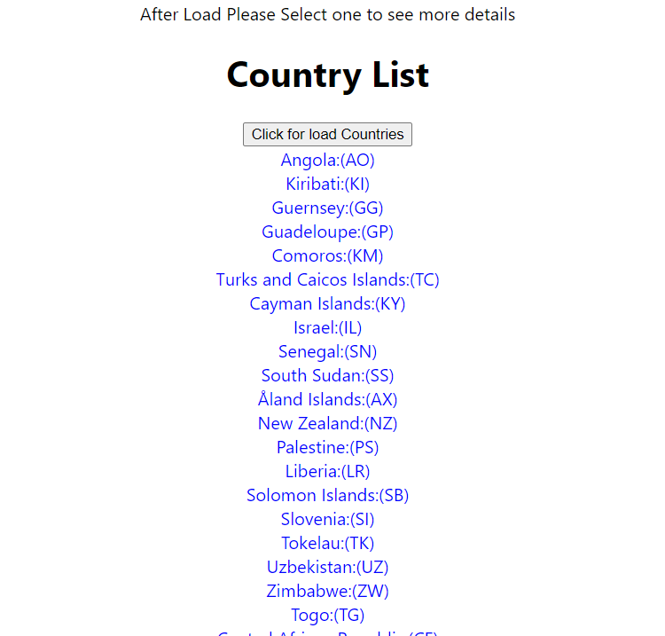
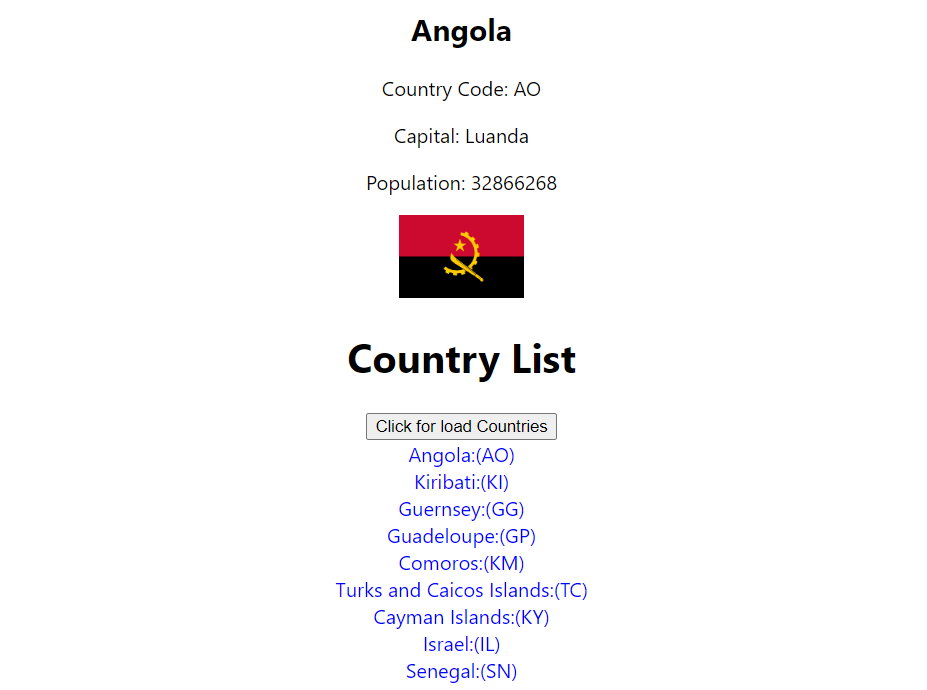

# Country Information Microservice

This project implements a microservice that provides a list of countries and detailed information for each country. The microservice is built using Spring Boot and follows best practices for microservice architecture.

## Features

- **REST API**:
  - `GET /countries/`: Fetches a list of all countries.
  - `GET /countries/{name}`: Fetches detailed information about a specific country.
- **External Service Integration**: The country service fetches relevant information from an external service, for example, [RestCountries](https://restcountries.eu/)

## Bonus Features

- **Reactor Core**: Utilizes Reactor for reactive programming.
- **Web Application**: A separate web application that utilizes the REST API to display country information in a browser.

## Getting Started

### Prerequisites

- Java 11 or later
- Maven
- Git

### Installation

1. **Clone the repository**:
   - git clone https://github.com/Nandalochana/Coding_Assignment.git
   - cd Coding_Assignment/assignment

2. Build the project  : `mvn clean install`
3. Run the application: `mvn spring-boot:run`

# Usage

Once the application is running, you can access the REST API endpoints:

- List all countries               : http://localhost:8080/countries/
 
- Get details of a specific country: http://localhost:8080/countries/{name}

# Testing

The implementation includes tests that can be run with Maven:

- mvn test

# Web Application

A separate web application is included in the repository. To run the web application:

**Navigate to the web application directory:**

- cd react-CA/clientview

**Install dependencies and start the application:**

- npm install
- npm start

**Open your browser and go to http://localhost:3000 to see the country information displayed.**

# Contact
For any inquiries or feedback, please contact danushkanandalochana@gmail.com.

